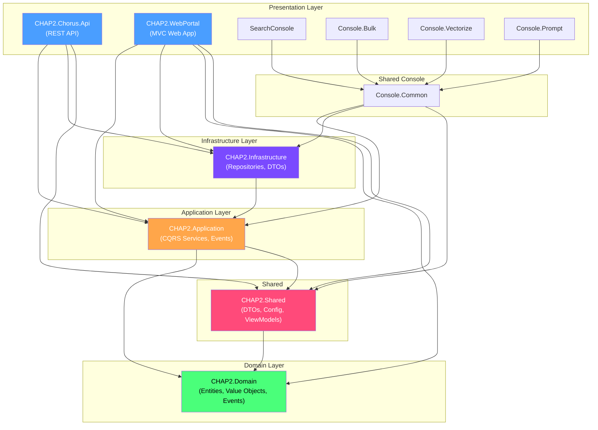
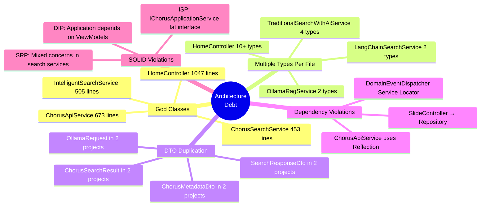
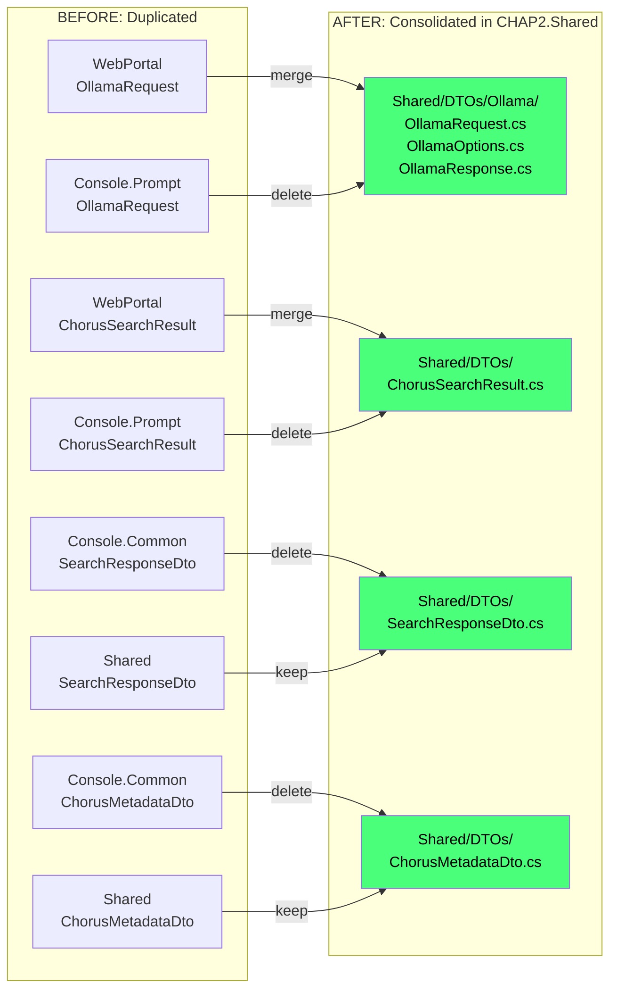
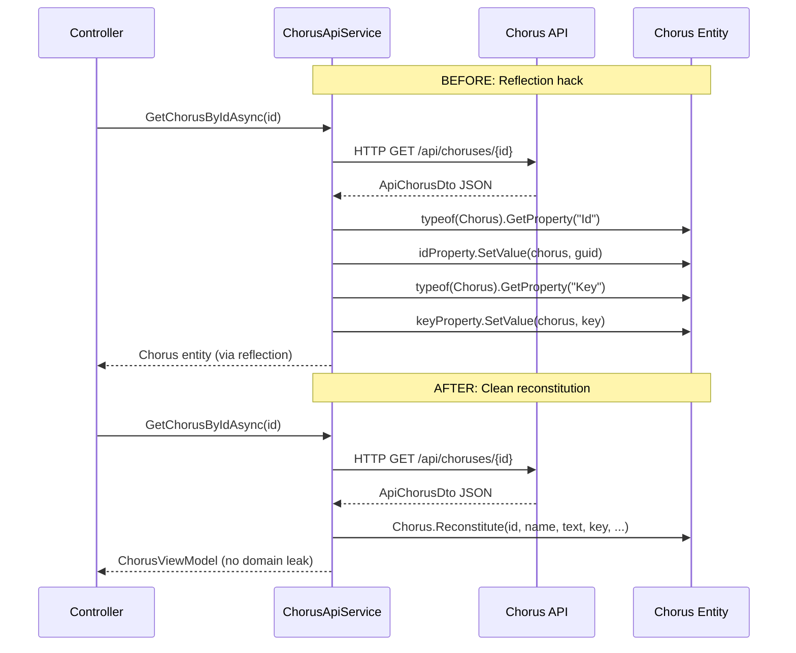
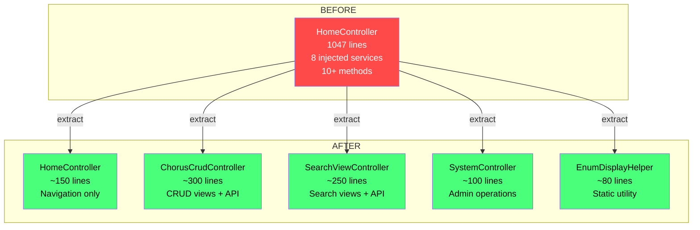
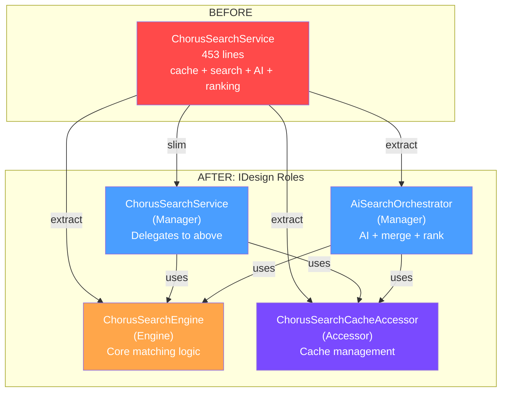
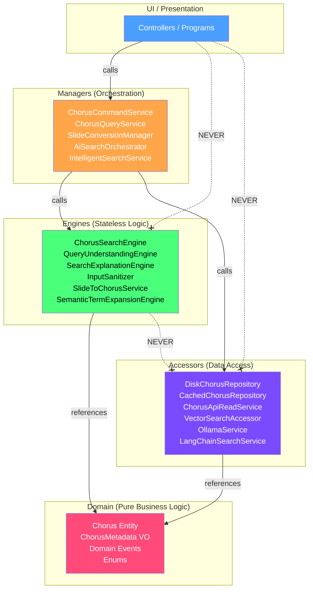
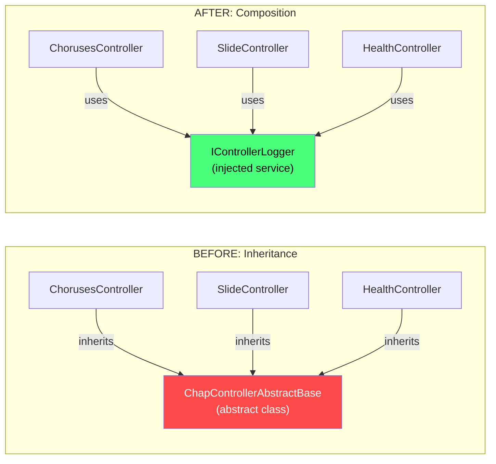

# CHAP2 Refactoring Plan: IDesign + SOLID + One Type Per File

## Context

The CHAP2 solution is a .NET 9 church chorus management system with 10 projects and ~131 C# files. While it has a reasonable foundation (CQRS pattern, domain events, repository pattern), it has accumulated significant architectural debt: God classes (HomeController at 1047 lines, ChorusApiService at 673 lines), multiple types per file, DTO duplication across layers, reflection hacks on domain entities, dependency direction violations (controllers accessing repositories directly), and fat interfaces. This refactoring will bring the codebase into alignment with IDesign methodology, SOLID principles, and clean architecture conventions.

---

## Current Architecture

### Key Issues Identified

---

## Phase 1: One Type Per File + DTO Consolidation

**Goal:** Structural cleanup. No behavioral changes. Lowest risk.

### 1A. Extract inline types from HomeController.cs

8 request/response classes after line 987 need their own files.

Create `CHAP2.UI/CHAP2.WebPortal/Models/Requests/`:
- `TraditionalSearchRequest.cs`, `AskQuestionRequest.cs`, `AiSearchRequest.cs`
- `RagSearchRequest.cs`, `IntelligentSearchRequest.cs`, `RestartSystemRequest.cs`
- `SaveChorusRequest.cs`, `DeleteChorusRequest.cs`

Create `CHAP2.UI/CHAP2.WebPortal/DTOs/LlmSearchResult.cs`

### 1B. Extract inline types from WebPortal services

| Source File | Extract | Target |
|---|---|---|
| `TraditionalSearchWithAiService.cs` | `ITraditionalSearchWithAiService` | `Interfaces/ITraditionalSearchWithAiService.cs` |
| `TraditionalSearchWithAiService.cs` | `SearchFilters` | `Models/SearchFilters.cs` |
| `TraditionalSearchWithAiService.cs` | `SearchWithAiResult` | `DTOs/SearchWithAiResult.cs` |
| `OllamaRagService.cs` | `IOllamaRagService` | `Interfaces/IOllamaRagService.cs` |
| `LangChainSearchService.cs` | `ILangChainSearchService` | `Interfaces/ILangChainSearchService.cs` |
| `SearchController.cs` | `SearchApiRequest` | `Models/Requests/SearchApiRequest.cs` |

### 1C. Consolidate duplicate DTOs

### 1D. Verify
- `dotnet build CHAP2Debug.sln` passes
- `dotnet test` passes
- Zero behavioral changes

---

## Phase 2: Domain Immutability + Eliminate Reflection

**Goal:** Fix the domain model so downstream code never needs reflection.

### 2A. Make ChorusMetadata a proper value object
- File: `CHAP2.Domain/ValueObjects/ChorusMetadata.cs`
- Change all public setters to `{ get; init; }`
- Add `With*` methods for mutation (return new instances)

### 2B. Make Chorus.Reconstitute public
- File: `CHAP2.Domain/Entities/Chorus.cs`
- Change `internal static Chorus Reconstitute(...)` to `public static`

### 2C. Eliminate all reflection in ChorusApiService
- File: `CHAP2.UI/CHAP2.WebPortal/Services/ChorusApiService.cs`
- Replace 4 reflection blocks (~30 lines each) with single `Chorus.Reconstitute()` calls
- Extract `MapDtoToChorus(ApiChorusDto dto)` helper method

### 2D. Stop returning domain entities from IChorusApiService
- Change `IChorusApiService` return types from `Chorus` to DTOs/ViewModels
- Update HomeController to work with DTOs instead of domain entities
- Delete all reflection code

### 2E. Verify
- `dotnet build` + `dotnet test`
- Grep for `GetProperty` - should be zero in non-test code

---

## Phase 3: Break Up God Classes (SRP)

### 3A. Split HomeController (1047 lines, 8+ injected services)

| New Controller | Responsibility |
|---|---|
| `ChorusCrudController` | CRUD views + API endpoints |
| `SearchViewController` | Search-related views + API endpoints |
| `SystemController` | System administration |
| `HomeController` (slimmed) | Navigation only (Index, CleanSearch) |

Extract `GetKeyDisplayName`, `GetTypeDisplayName`, `GetTimeSignatureDisplayName` to `Helpers/EnumDisplayHelper.cs`

### 3B. Split ChorusSearchService (453 lines)

| New Class | IDesign Role | Responsibility |
|---|---|---|
| `ChorusSearchEngine` | Engine | Core matching: `MatchesSearch`, `IsRegexMatch`, search-by-scope |
| `ChorusSearchCacheAccessor` | Accessor | `GetCachedChorusesAsync`, `InvalidateCache` |
| `AiSearchOrchestrator` | Manager | `SearchWithAiAsync`, merge+rank results |
| `ChorusSearchService` (slimmed) | Manager | `SearchAsync` - delegates to Engine + Cache |

### 3C. Split ChorusApiService (673 lines)

| New Class | Responsibility |
|---|---|
| `ChorusApiReadService` | Get, GetAll, GetByName, Search, TestConnectivity |
| `ChorusApiWriteService` | Create, Update, Delete (+ vector DB sync) |
| `SlideApiService` | ConvertSlide |

Split `IChorusApiService` into `IChorusApiReadService`, `IChorusApiWriteService`, `ISlideApiService`

### 3D. Split IntelligentSearchService (505 lines)

| New Class | IDesign Role |
|---|---|
| `QueryUnderstandingEngine` | Engine - prompt construction for query understanding |
| `SearchExplanationEngine` | Engine - explanation generation |
| `SearchAnalysisEngine` | Engine - analysis generation |
| `IntelligentSearchService` (slimmed) | Manager - orchestration only |

### 3E. Verify
- Each new class < 200 lines, max 4 dependencies
- `dotnet build` + `dotnet test`

---

## Phase 4: Dependency Direction + IDesign Layering

### 4A. Fix SlideController direct repository access
- File: `CHAP2.Chorus.Api/Controllers/SlideController.cs`
- Create `ISlideConversionManager` in Application layer
- Move convert+check+save logic from controller to manager
- Controller becomes thin HTTP adapter

### 4B. Fix DomainEventDispatcher service locator
- File: `CHAP2.Application/Services/DomainEventDispatcher.cs`
- Replace `IServiceProvider` + reflection with explicit handler injection
- Or create `DomainEventHandlerRegistry` for type-safe dispatch

### 4C. Split IChorusApplicationService (ISP violation)
- File: `CHAP2.Application/Interfaces/IChorusApplicationService.cs`
- Remove ViewModel dependencies from Application layer
- Use existing `IChorusCommandService` + `IChorusQueryService` instead
- Deprecate `IChorusApplicationService` if redundant

### 4D. Remove Application → Shared ViewModels dependency
- Create Application-layer command records: `CreateChorusCommand`, `UpdateChorusCommand`
- Change `ChorusApplicationService` to accept commands, not ViewModels
- Evaluate removing Shared project reference from Application.csproj

### 4E. Enforce IDesign call chain

**Rules:**
- Controllers → Managers only
- Managers → Engines + Accessors
- Engines → Domain only (stateless, no data access)
- Accessors → External systems only (DB, HTTP, files)

### 4F. Verify
- `dotnet build` + `dotnet test`
- Verify no layer-skipping in dependency graph

---

## Phase 5: Composition Over Inheritance + Cleanup

### 5A. Replace ChapControllerAbstractBase inheritance

- Only provides `LogAction` helper - poor use of inheritance
- Create `IControllerLogger` + `ControllerLogger` (composition)
- Inject into controllers, delete abstract base class

### 5B. Split IVectorSearchService (ISP)
- `IVectorSearchAccessor` - read operations
- `IVectorWriteAccessor` - write operations
- `IEmbeddingEngine` - embedding generation (computation, not data access)

### 5C. Fix AiSearchService async methods
- File: `CHAP2.Application/Services/AiSearchService.cs`
- Remove `async` keyword from methods that don't await, return `Task.FromResult`

### 5D. Remove dead code
- Delete `IServices` + `Services.cs` (placeholder with no real functionality)
- Delete `IController` interface (only used by removed base class)

### 5E. Verify
- `dotnet build` with zero warnings
- `dotnet test`

---

## Phase 6: Tests + Security

### 6A. Add unit tests for new classes
Priority: `ChorusSearchEngine`, `SlideConversionManager`, `ChorusApiReadService`, new controllers

### 6B. Fix CORS configuration
- Replace `AllowAnyOrigin()` with explicit allowlist
- Remove manual `Access-Control-Allow-Origin: *` headers

### 6C. Add Chorus.MarkAsDeleted domain method
- Raises `ChorusDeletedEvent` for complete entity lifecycle

---

## IDesign Classification Summary (Post-Refactoring)

```mermaid
graph TB
    subgraph "Managers (Orchestrate Workflow)"
        M1["ChorusCommandService"]
        M2["ChorusQueryService"]
        M3["SlideConversionManager"]
        M4["AiSearchOrchestrator"]
        M5["IntelligentSearchService"]
        M6["ConsoleApplicationService"]
    end

    subgraph "Engines (Stateless Business Logic)"
        E1["ChorusSearchEngine"]
        E2["QueryUnderstandingEngine"]
        E3["SearchExplanationEngine"]
        E4["SearchAnalysisEngine"]
        E5["InputSanitizer"]
        E6["SlideToChorusService"]
        E7["SemanticTermExpansionEngine"]
        E8["EnumDisplayHelper"]
    end

    subgraph "Accessors (Data Access)"
        A1["DiskChorusRepository"]
        A2["CachedChorusRepository"]
        A3["ChorusApiReadService"]
        A4["ChorusApiWriteService"]
        A5["VectorSearchAccessor"]
        A6["VectorWriteAccessor"]
        A7["OllamaService"]
        A8["LangChainSearchService"]
        A9["ApiClientService"]
        A10["QdrantService"]
    end

    subgraph "Utilities (Cross-Cutting)"
        U1["DomainEventDispatcher"]
        U2["ControllerLogger"]
        U3["Configuration Classes"]
    end

    M1 --> E5
    M1 --> A1
    M2 --> A1
    M2 --> E1
    M3 --> E6
    M3 --> A1
    M4 --> E1
    M4 --> E7
    M5 --> E2
    M5 --> E3
    M5 --> E4
    M5 --> A8

    style M1 fill:#4a9eff,color:#fff
    style M2 fill:#4a9eff,color:#fff
    style M3 fill:#4a9eff,color:#fff
    style M4 fill:#4a9eff,color:#fff
    style M5 fill:#4a9eff,color:#fff
    style M6 fill:#4a9eff,color:#fff
    style E1 fill:#ffa64a,color:#fff
    style E2 fill:#ffa64a,color:#fff
    style E3 fill:#ffa64a,color:#fff
    style E4 fill:#ffa64a,color:#fff
    style E5 fill:#ffa64a,color:#fff
    style E6 fill:#ffa64a,color:#fff
    style E7 fill:#ffa64a,color:#fff
    style E8 fill:#ffa64a,color:#fff
    style A1 fill:#7a4aff,color:#fff
    style A2 fill:#7a4aff,color:#fff
    style A3 fill:#7a4aff,color:#fff
    style A4 fill:#7a4aff,color:#fff
    style A5 fill:#7a4aff,color:#fff
    style A6 fill:#7a4aff,color:#fff
    style A7 fill:#7a4aff,color:#fff
    style A8 fill:#7a4aff,color:#fff
    style A9 fill:#7a4aff,color:#fff
    style A10 fill:#7a4aff,color:#fff
    style U1 fill:#888,color:#fff
    style U2 fill:#888,color:#fff
    style U3 fill:#888,color:#fff
```

---

## Phase Execution Overview

```mermaid
gantt
    title Refactoring Phases (Sequential, Independently Shippable)
    dateFormat X
    axisFormat %s

    section Phase 1
    One Type Per File + DTO Consolidation    :p1, 0, 40
    section Phase 2
    Domain Immutability + Eliminate Reflection :p2, 40, 55
    section Phase 3
    Break Up God Classes (SRP)               :p3, 55, 85
    section Phase 4
    Dependency Direction + IDesign Layering   :p4, 85, 110
    section Phase 5
    Composition Over Inheritance + Cleanup    :p5, 110, 125
    section Phase 6
    Tests + Security                         :p6, 125, 145
```

| Phase | Risk | Estimated Files |
|---|---|---|
| 1: One Type Per File + DTO Consolidation | Low (structural only) | ~40 |
| 2: Domain Immutability + Eliminate Reflection | Medium (API contract) | ~15 |
| 3: Break Up God Classes | Medium (behavioral splits) | ~30 |
| 4: Dependency Direction + IDesign Layering | Medium-High (architecture) | ~25 |
| 5: Composition + SOLID Cleanup | Low (cleanup) | ~15 |
| 6: Tests + Security | Low (additive) | ~20 |

---

## Critical Files

| File | Lines | Issue | Phase |
|---|---|---|---|
| `CHAP2.WebPortal/Controllers/HomeController.cs` | 1047 | 10+ inline types, 8 deps, God class | 1A, 3A |
| `CHAP2.WebPortal/Services/ChorusApiService.cs` | 673 | 4x reflection blocks, returns domain entities | 2C, 2D, 3C |
| `CHAP2.Application/Services/ChorusSearchService.cs` | 453 | Mixed cache+search+AI+ranking | 3B |
| `CHAP2.WebPortal/Services/IntelligentSearchService.cs` | 505 | Mixed orchestration+prompt+analysis | 3D |
| `CHAP2.Domain/Entities/Chorus.cs` | ~180 | Reconstitute needs public visibility | 2B |
| `CHAP2.Chorus.Api/Controllers/SlideController.cs` | ~130 | Direct repo access | 4A |
| `CHAP2.Application/Services/DomainEventDispatcher.cs` | 72 | Service locator anti-pattern | 4B |
| `CHAP2.Chorus.Api/Controllers/ChapControllerAbstractBase.cs` | 26 | Unnecessary inheritance | 5A |
