# CHAP2 Refactoring Plan: IDesign + SOLID + One Type Per File

## Context

The CHAP2 solution is a .NET 9 church chorus management system with 10 projects and ~131 C# files. A code quality review identified 89 findings (10 critical, 42 major, 37 minor). Security hardening, test coverage, performance cleanup, and several architecture fixes have been completed. This plan covers the **remaining structural refactoring** needed to achieve full IDesign, SOLID, one-type-per-file, dependency inversion, and composition-over-inheritance compliance.

### What's Already Done
- CORS restricted, regex DoS fixed, HTTPS enforcement, dead code removed
- XSS innerHTML fixes across 7 JS files, debug scripts gated, accessibility improvements
- 62 tests passing (30 new: repository, cache, search, controller)
- Domain event dispatch dedup, reflection removed from SlideToChorusService
- WebPortal repository wrapped with CachedChorusRepository
- Constructor null guards, async fixes, TryParse, SearchApiRequest extracted

### What Still Needs Fixing (12 violations across 7 criteria)

| Criterion | Status | Violations |
|---|---|---|
| One Type Per File | VIOLATED | HomeController (10 types), TraditionalSearchWithAiService (4), OllamaRequest (2x2) |
| God Classes | VIOLATED | HomeController (1046 lines, 9 deps), ChorusApiService (672), IntelligentSearchService (505), ChorusSearchService (456) |
| Dependency Inversion | VIOLATED | SlideController→Repository, ChorusApiService reflection (34 instances), DomainEventDispatcher service locator, Application→ViewModels |
| Composition over Inheritance | VIOLATED | ChapControllerAbstractBase still inherited |
| DTO Duplication | VIOLATED | OllamaRequest/Response, ChorusSearchResult across WebPortal + Console.Prompt |
| Interface Segregation | VIOLATED | IChorusApplicationService (5 mixed methods), IVectorSearchService (read+write+compute) |
| IDesign Layering | VIOLATED | Controllers calling Accessors directly, Engines mixed with Managers |

---

## Current Architecture

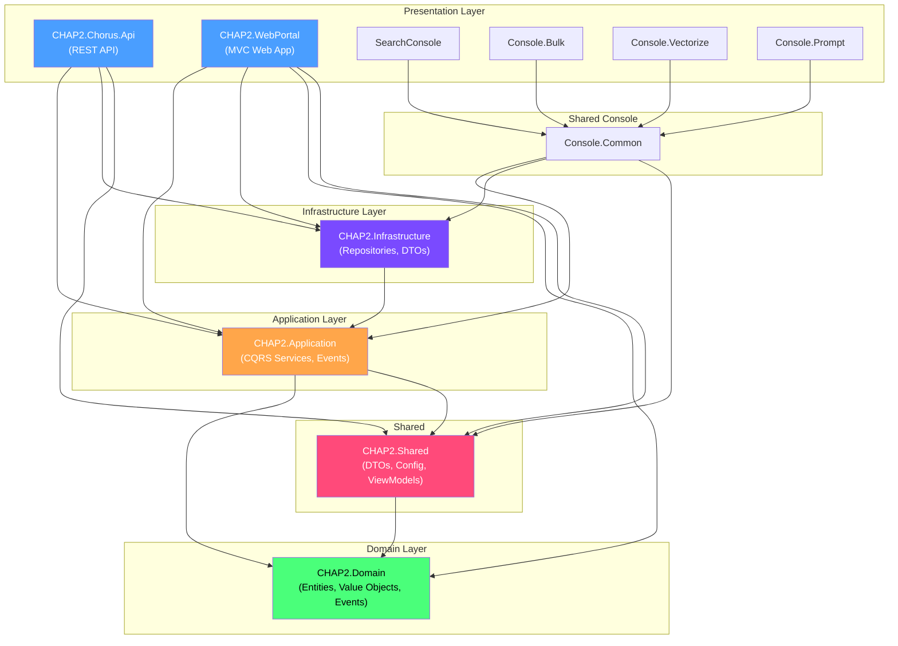

---

## Phase 1: One Type Per File + DTO Consolidation

**Goal:** Every .cs file contains exactly one public type. Eliminate all DTO duplication. Pure structural moves, no behavioral changes.

### 1A. Extract inline types from HomeController.cs (10 types → 1)

HomeController.cs currently has 10 public types after line 987. Extract each to its own file:

```
CHAP2.UI/CHAP2.WebPortal/Models/Requests/
├── TraditionalSearchRequest.cs
├── AskQuestionRequest.cs
├── AiSearchRequest.cs
├── RagSearchRequest.cs
├── IntelligentSearchRequest.cs
├── RestartSystemRequest.cs
├── SaveChorusRequest.cs
└── DeleteChorusRequest.cs

CHAP2.UI/CHAP2.WebPortal/DTOs/
└── LlmSearchResult.cs
```

### 1B. Extract inline types from TraditionalSearchWithAiService.cs (4 types → 1)

| Type | Target File |
|---|---|
| `ITraditionalSearchWithAiService` | `Interfaces/ITraditionalSearchWithAiService.cs` |
| `SearchFilters` | `Models/SearchFilters.cs` |
| `SearchWithAiResult` | `DTOs/SearchWithAiResult.cs` |

### 1C. Extract OllamaOptions from OllamaRequest.cs files

Both WebPortal and Console.Prompt have `OllamaRequest` + `OllamaOptions` in the same file. Split `OllamaOptions` to its own file in each, then consolidate in step 1D.

### 1D. Consolidate duplicate DTOs

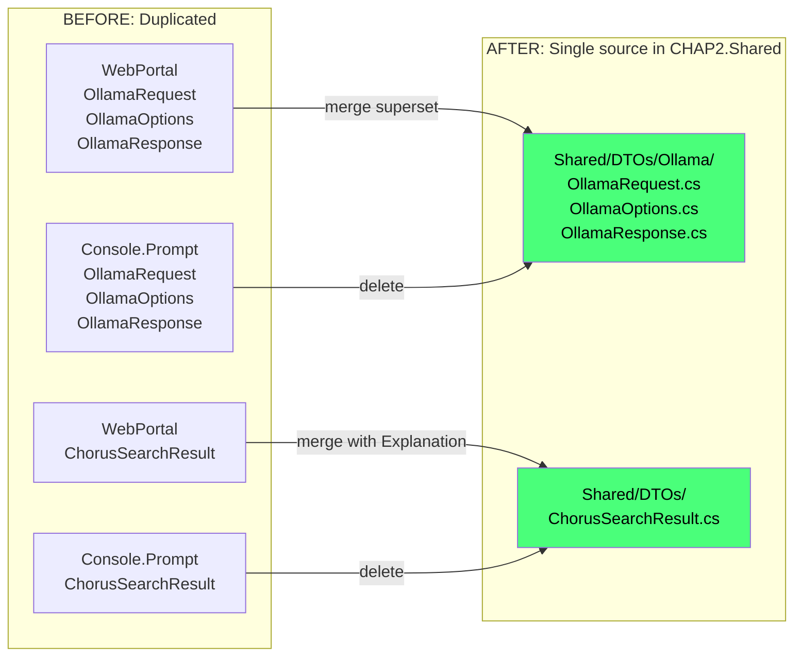

- Merge `OllamaRequest`, `OllamaOptions`, `OllamaResponse` into `CHAP2.Shared/DTOs/Ollama/`
- Use superset of properties (WebPortal has TopP, TopK, RepeatPenalty)
- Make default values configurable, not hardcoded
- Merge `ChorusSearchResult` into `CHAP2.Shared/DTOs/` with `Explanation` property included
- Delete all local copies, update references

### 1E. Verify
- `dotnet build CHAP2Debug.sln` passes
- `dotnet test` passes
- Zero behavioral changes

---

## Phase 2: Eliminate Reflection in ChorusApiService

**Goal:** Remove all 34 instances of `GetProperty`/`SetValue` reflection from ChorusApiService.

### 2A. Make Chorus.Reconstitute fully public

File: `CHAP2.Domain/Entities/Chorus.cs`
- Verify `Reconstitute` is `public static` (may already be done)
- Ensure it accepts all properties needed by ChorusApiService

### 2B. Replace all reflection blocks in ChorusApiService

File: `CHAP2.UI/CHAP2.WebPortal/Services/ChorusApiService.cs` (672 lines)
- 4 methods each have ~30-line reflection blocks (lines 106-134, 212-236, 294-318, 367-391)
- Replace each with `Chorus.Reconstitute(id, name, text, key, type, timeSig, createdAt, updatedAt, metadata)`
- Extract `MapDtoToChorus(ApiChorusDto dto)` private helper to DRY the mapping

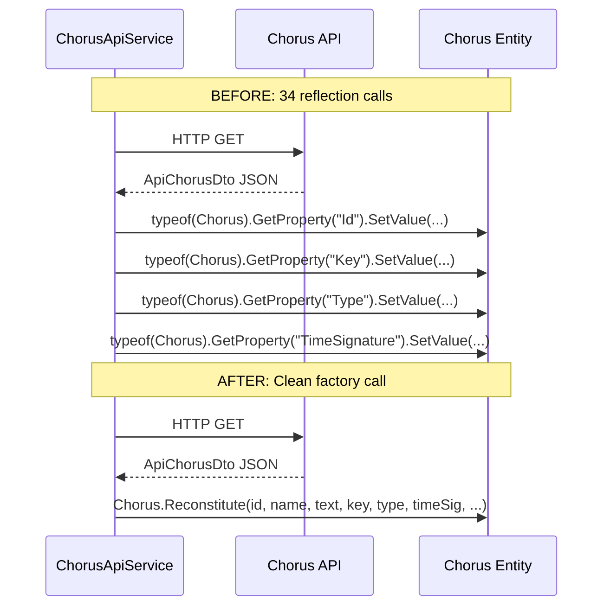

### 2C. Stop returning domain entities from IChorusApiService

- Change `IChorusApiService` return types from `Chorus` to `ChorusViewModel` or DTOs
- Update HomeController to work with view models
- This eliminates the need for reflection entirely

### 2D. Verify
- `dotnet build` + `dotnet test`
- `grep -r "GetProperty" --include="*.cs"` returns zero hits in non-test code

---

## Phase 3: Break Up God Classes (SRP)

### 3A. Split HomeController (1046 lines → 4 controllers)

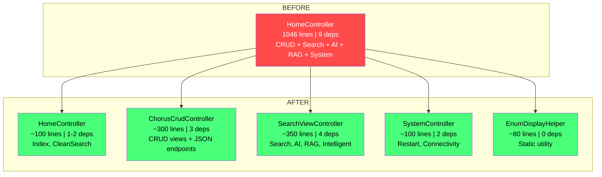

Extract `GetKeyDisplayName`, `GetTypeDisplayName`, `GetTimeSignatureDisplayName` to `Helpers/EnumDisplayHelper.cs`.

### 3B. Split ChorusSearchService (456 lines → 4 classes)

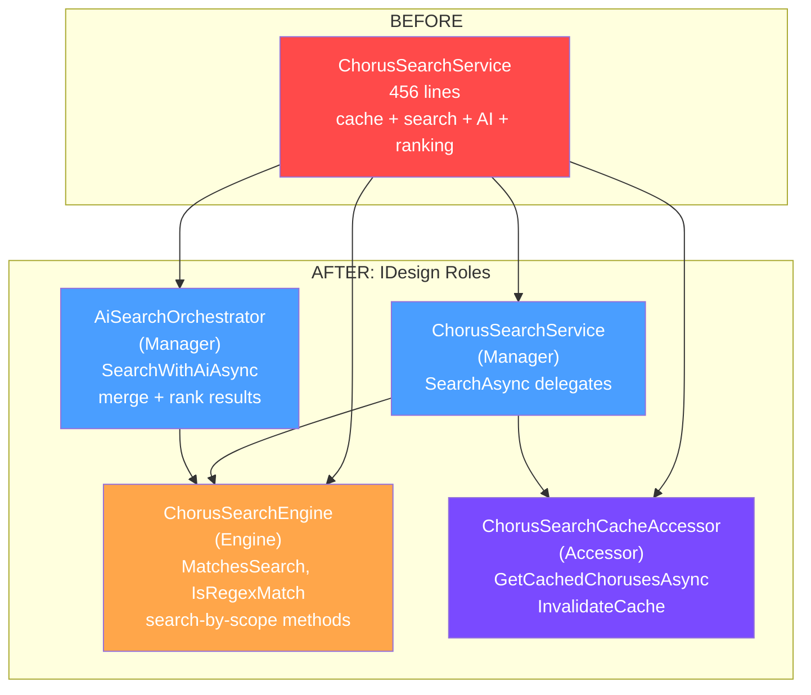

### 3C. Split ChorusApiService (672 lines → 3 services)

| New Class | Interface | Responsibility |
|---|---|---|
| `ChorusApiReadService` | `IChorusApiReadService` | Get, GetAll, GetByName, Search, TestConnectivity |
| `ChorusApiWriteService` | `IChorusApiWriteService` | Create, Update, Delete (+ vector DB sync) |
| `SlideApiService` | `ISlideApiService` | ConvertSlide |

### 3D. Split IntelligentSearchService (505 lines → 4 classes)

| New Class | IDesign Role |
|---|---|
| `QueryUnderstandingEngine` | Engine - prompt construction |
| `SearchExplanationEngine` | Engine - explanation generation |
| `SearchAnalysisEngine` | Engine - analysis generation |
| `IntelligentSearchService` (slimmed) | Manager - orchestration only |

### 3E. Verify
- Each new class < 200 lines, max 4 dependencies
- `dotnet build` + `dotnet test`

---

## Phase 4: Dependency Inversion + IDesign Layering

### 4A. Fix SlideController direct repository access

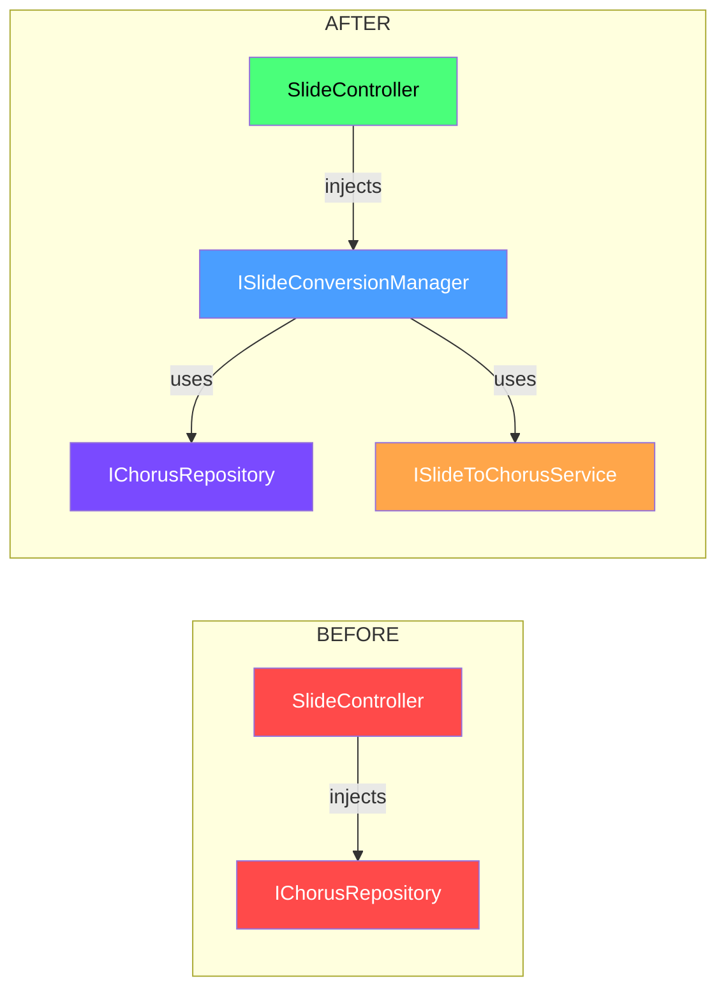

- Create `ISlideConversionManager` in Application layer
- Move convert+check+save logic from controller into manager
- Controller becomes thin HTTP adapter

### 4B. Fix DomainEventDispatcher service locator

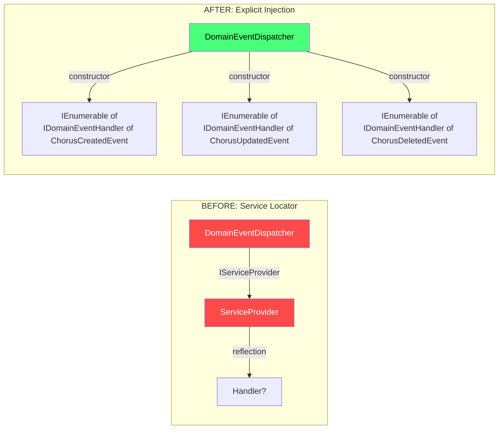

- Replace `IServiceProvider` + reflection with explicit handler injection
- Or create `DomainEventHandlerRegistry` for type-safe dispatch without reflection

### 4C. Remove Application → Shared ViewModels dependency

- `IChorusApplicationService` currently accepts `ChorusCreateViewModel` and `ChorusEditViewModel`
- Create Application-layer command records:
  ```csharp
  public record CreateChorusCommand(string Name, string ChorusText, MusicalKey Key, ChorusType Type, TimeSignature TimeSignature);
  public record UpdateChorusCommand(string Id, string Name, string ChorusText, MusicalKey Key, ChorusType Type, TimeSignature TimeSignature);
  ```
- Change service to accept commands, not ViewModels
- Consider deprecating `IChorusApplicationService` since `IChorusCommandService` + `IChorusQueryService` already exist

### 4D. Split IVectorSearchService (ISP)

| New Interface | Responsibility |
|---|---|
| `IVectorSearchAccessor` | `SearchSimilarAsync`, `GetAllChorusesAsync` |
| `IVectorWriteAccessor` | `UpsertAsync`, `DeleteAsync` |
| `IEmbeddingEngine` | `GenerateEmbeddingAsync` (computation, not data access) |

### 4E. Enforce IDesign call chain

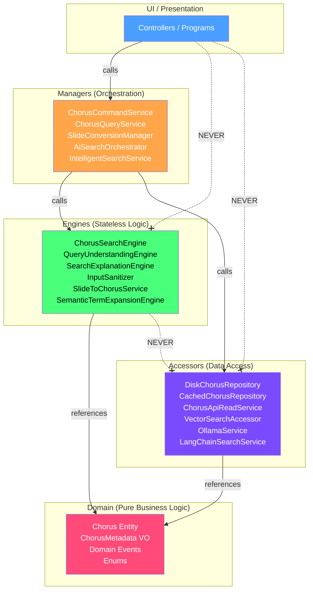

### 4F. Verify
- `dotnet build` + `dotnet test`
- Verify no layer-skipping in dependency graph

---

## Phase 5: Composition Over Inheritance + Final Cleanup

### 5A. Replace ChapControllerAbstractBase inheritance

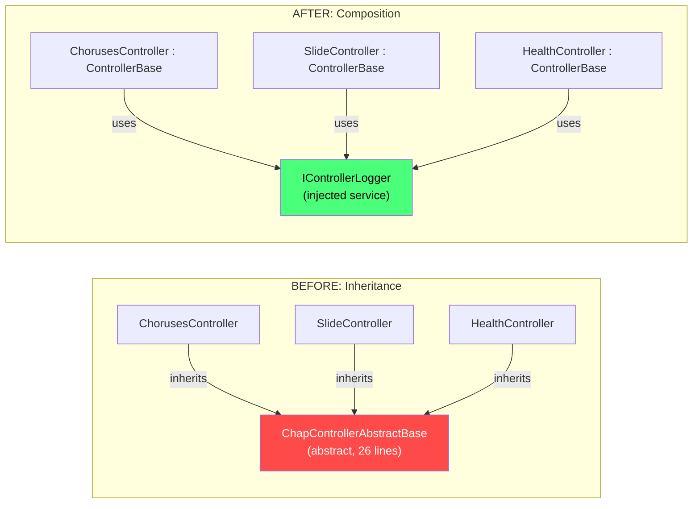

- Create `IControllerLogger` + `ControllerLogger`
- Inject into controllers instead of inheriting
- Delete `ChapControllerAbstractBase.cs`

### 5B. Make ChorusMetadata a true value object

- Change all public setters to `{ get; init; }`
- Replace `List<string> Tags` with `IReadOnlyList<string>`
- Replace mutable Dictionary with `IReadOnlyDictionary`
- Add `With*` methods for creating modified copies
- Update `ChorusMetadataJsonConverter`

### 5C. Verify
- `dotnet build` with zero warnings
- `dotnet test` - all 62+ tests pass

---

## Phase Execution Overview

```mermaid
gantt
    title Refactoring Phases
    dateFormat X
    axisFormat %s

    section Phase 1
    One Type Per File + DTO Consolidation    :p1, 0, 30
    section Phase 2
    Eliminate Reflection in ChorusApiService  :p2, 30, 50
    section Phase 3
    Break Up God Classes (SRP)               :p3, 50, 85
    section Phase 4
    Dependency Inversion + IDesign Layering   :p4, 85, 115
    section Phase 5
    Composition + Final Cleanup              :p5, 115, 135
```

| Phase | Risk | Estimated Files Changed |
|---|---|---|
| 1: One Type Per File + DTO Consolidation | Low (structural only) | ~25 |
| 2: Eliminate Reflection | Medium (API contract) | ~10 |
| 3: Break Up God Classes | Medium (behavioral splits) | ~25 |
| 4: Dependency Inversion + IDesign | Medium-High (architecture) | ~20 |
| 5: Composition + Cleanup | Low (cleanup) | ~15 |

---

## IDesign Classification (Post-Refactoring)

```mermaid
graph TB
    subgraph "Managers"
        M1["ChorusCommandService"]
        M2["ChorusQueryService"]
        M3["SlideConversionManager"]
        M4["AiSearchOrchestrator"]
        M5["IntelligentSearchService"]
        M6["ConsoleApplicationService"]
    end

    subgraph "Engines"
        E1["ChorusSearchEngine"]
        E2["QueryUnderstandingEngine"]
        E3["SearchExplanationEngine"]
        E4["SearchAnalysisEngine"]
        E5["InputSanitizer"]
        E6["SlideToChorusService"]
        E7["SemanticTermExpansionEngine"]
        E8["EnumDisplayHelper"]
        E9["EmbeddingEngine"]
    end

    subgraph "Accessors"
        A1["DiskChorusRepository"]
        A2["CachedChorusRepository"]
        A3["ChorusApiReadService"]
        A4["ChorusApiWriteService"]
        A5["VectorSearchAccessor"]
        A6["VectorWriteAccessor"]
        A7["OllamaService"]
        A8["LangChainSearchService"]
    end

    subgraph "Utilities"
        U1["DomainEventDispatcher"]
        U2["ControllerLogger"]
    end

    M1 --> E5
    M1 --> A1
    M2 --> A1
    M2 --> E1
    M3 --> E6
    M3 --> A1
    M4 --> E1
    M4 --> E7
    M5 --> E2
    M5 --> E3
    M5 --> E4
    M5 --> A8

    style M1 fill:#4a9eff,color:#fff
    style M2 fill:#4a9eff,color:#fff
    style M3 fill:#4a9eff,color:#fff
    style M4 fill:#4a9eff,color:#fff
    style M5 fill:#4a9eff,color:#fff
    style M6 fill:#4a9eff,color:#fff
    style E1 fill:#ffa64a,color:#fff
    style E2 fill:#ffa64a,color:#fff
    style E3 fill:#ffa64a,color:#fff
    style E4 fill:#ffa64a,color:#fff
    style E5 fill:#ffa64a,color:#fff
    style E6 fill:#ffa64a,color:#fff
    style E7 fill:#ffa64a,color:#fff
    style E8 fill:#ffa64a,color:#fff
    style E9 fill:#ffa64a,color:#fff
    style A1 fill:#7a4aff,color:#fff
    style A2 fill:#7a4aff,color:#fff
    style A3 fill:#7a4aff,color:#fff
    style A4 fill:#7a4aff,color:#fff
    style A5 fill:#7a4aff,color:#fff
    style A6 fill:#7a4aff,color:#fff
    style A7 fill:#7a4aff,color:#fff
    style A8 fill:#7a4aff,color:#fff
    style U1 fill:#888,color:#fff
    style U2 fill:#888,color:#fff
```

---

## Critical Files

| File | Lines | Violations | Phase |
|---|---|---|---|
| `WebPortal/Controllers/HomeController.cs` | 1046 | 10 inline types, 9 deps, God class | 1A, 3A |
| `WebPortal/Services/ChorusApiService.cs` | 672 | 34 reflection calls, returns domain entities | 2B, 2C, 3C |
| `WebPortal/Services/IntelligentSearchService.cs` | 505 | Mixed orchestration+prompt+analysis | 3D |
| `Application/Services/ChorusSearchService.cs` | 456 | Mixed cache+search+AI+ranking | 3B |
| `WebPortal/Services/TraditionalSearchWithAiService.cs` | 288 | 4 types in one file | 1B |
| `Chorus.Api/Controllers/SlideController.cs` | ~130 | Direct repo injection | 4A |
| `Application/Services/DomainEventDispatcher.cs` | 72 | Service locator anti-pattern | 4B |
| `Application/Interfaces/IChorusApplicationService.cs` | ~20 | Fat interface + ViewModel dependency | 4C |
| `Chorus.Api/Controllers/ChapControllerAbstractBase.cs` | 26 | Unnecessary inheritance | 5A |
| `Domain/ValueObjects/ChorusMetadata.cs` | ~60 | Mutable value object | 5B |
