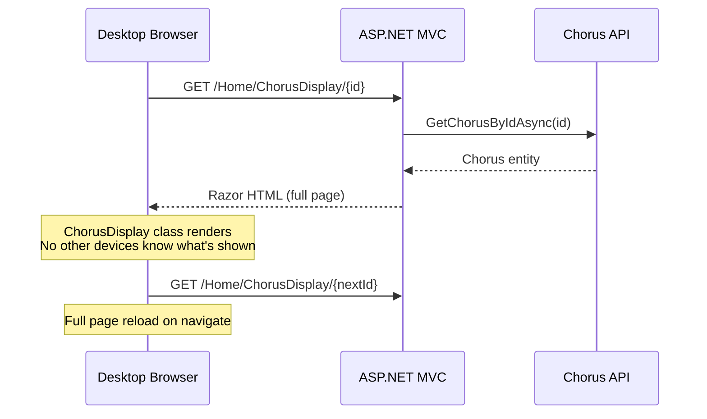
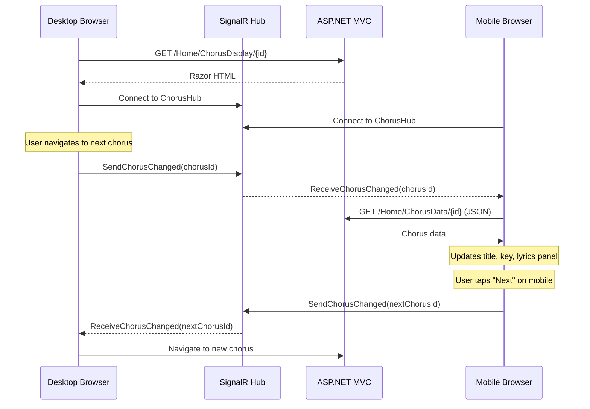
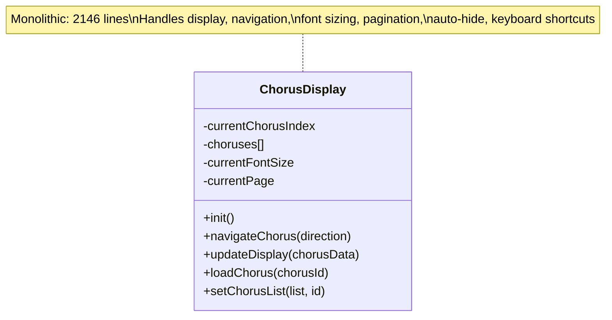
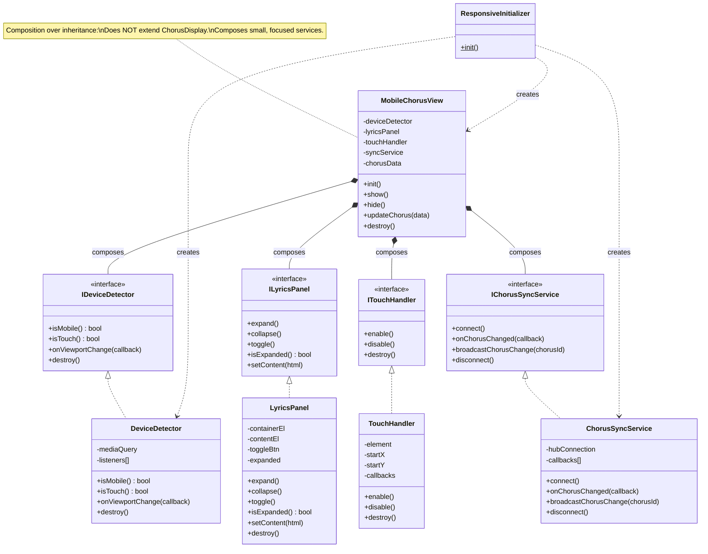
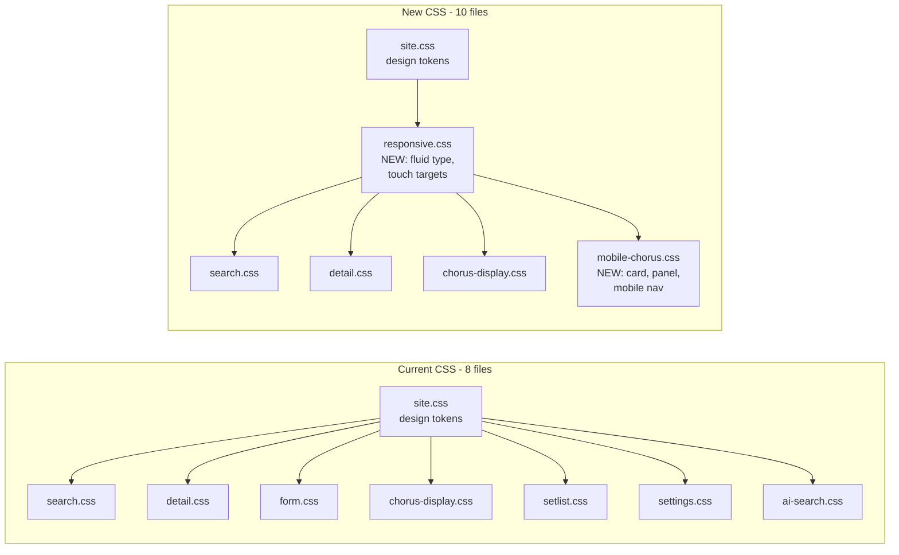

# CHAP2 Responsive & Mobile Chorus View - Implementation Plan

## Context

The CHAP2 Web Portal is a desktop-focused musical chorus management system. When used in a worship/praise setting, the desktop shows the chorus on a projector while mobile users (worship leaders, musicians) need to see what's currently displayed -- title, key, and optionally lyrics. Currently there is no real-time sync between devices and the mobile experience is just a scaled-down desktop UI. This plan adds:

1. **Full responsive design** with industry-standard best practices (fluid type, touch targets, proper reflow)
2. **Mobile chorus companion view** -- compact card showing title + key, expandable lyrics panel
3. **Real-time sync** -- mobile auto-updates when the chorus changes on the server (desktop navigates)
4. **Mobile navigation** -- ability to advance to next/previous chorus from the mobile interface
5. **SOLID architecture** -- IDesign, one type per file, DIP, composition over inheritance, SoC

---

## Architecture Diagrams

### Current State: Desktop-Only Chorus Display



### Intended State: Real-Time Multi-Device Sync



### Current JS Architecture



### Intended JS Architecture (SOLID + Composition)



### CSS File Architecture: Current vs Intended



---

## Implementation Plan

### Phase 1: Server-Side -- SignalR Hub for Real-Time Sync

**Why**: The mobile needs to know when the chorus changes on the desktop (and vice versa). SignalR provides persistent WebSocket connections with automatic fallback to long-polling.

#### 1.1 Add SignalR NuGet package

**File**: `CHAP2.UI/CHAP2.WebPortal/CHAP2.Web.csproj`

SignalR is included in the ASP.NET Core shared framework for .NET 9, so no extra package needed -- just `AddSignalR()` in Program.cs.

#### 1.2 Create SignalR Hub

**New file**: `CHAP2.UI/CHAP2.WebPortal/Hubs/IChorusHub.cs`
- Interface defining the client methods (DIP):
  - `ReceiveChorusChanged(string chorusId)` -- notify clients of chorus change

**New file**: `CHAP2.UI/CHAP2.WebPortal/Hubs/ChorusHub.cs`
- Single type, single responsibility: relay chorus change events between connected clients
- Methods:
  - `SendChorusChanged(string chorusId)` -- called by any client, broadcasts to all others via `Clients.Others`
- Maps to endpoint: `/chorusHub`

#### 1.3 Register SignalR in Program.cs

**File**: `CHAP2.UI/CHAP2.WebPortal/Program.cs`

- Add `builder.Services.AddSignalR();`
- Add `app.MapHub<ChorusHub>("/chorusHub");`

#### 1.4 Add JSON endpoint for chorus data

**File**: `CHAP2.UI/CHAP2.WebPortal/Controllers/HomeController.cs`

Add a JSON endpoint for mobile to fetch chorus data without a full page:
```csharp
[HttpGet]
public async Task<IActionResult> ChorusData(string id)
{
    var chorus = await _chorusApiService.GetChorusByIdAsync(id);
    if (chorus == null) return NotFound();
    return Json(new { chorus.Id, chorus.Name, Key = chorus.Key.ToString(), chorus.ChorusText });
}
```

The existing `Detail` action returns a View, not JSON. The mobile view needs JSON to update in-place without page reload.

#### 1.5 Install SignalR client library

Run `libman install @microsoft/signalr -p unpkg -d wwwroot/lib/signalr/` or download `signalr.min.js` and place in `wwwroot/lib/signalr/`.

---

### Phase 2: CSS Foundation -- Responsive Utilities

#### 2.1 Create responsive.css

**New file**: `wwwroot/css/responsive.css`

Responsibility: Shared responsive utilities applied across ALL pages.

Contents:
- **Fluid typography**: Override `--font-size-*` tokens using `clamp()` so text scales smoothly from 320px to 1440px viewport width
- **Touch target enforcement**: `.touch-target` utility class ensuring `min-width: 44px; min-height: 44px` (WCAG 2.5.5)
- **Spacing adjustments** at breakpoints via `:root` overrides
- **Safe area insets**: `env(safe-area-inset-*)` for notched phones

#### 2.2 Create mobile-chorus.css

**New file**: `wwwroot/css/mobile-chorus.css`

Responsibility: All styles for the mobile chorus companion view.

Contents:
- `.mobile-chorus-card` -- compact card, hidden on desktop (`@media (min-width: 769px) { display: none }`)
- `.mobile-chorus-card__title` -- large, prominent title
- `.mobile-chorus-card__key` -- key badge
- `.lyrics-panel` -- expandable container (`max-height: 0; overflow: hidden; transition: max-height 0.35s ease`)
- `.lyrics-panel--expanded` -- open state with computed max-height
- `.lyrics-panel__toggle` -- chevron button, rotates on expand
- `.mobile-chorus-card__nav` -- prev/next navigation bar with touch-friendly 48px buttons
- `.mobile-chorus-card__sync-indicator` -- real-time connection status dot (green=connected, red=disconnected)

#### 2.3 Fix touch targets in existing CSS

**File**: `wwwroot/css/chorus-display.css`
- Line 790-794: `.control-btn` at 768px: change 35x35 to 44x44px
- Line 760-764: `.nav-btn` at 768px: change 40x40 to 48x48px
- At 768px: hide `.chorus-container`, `.controls-container`, `.page-indicator` (replaced by mobile view)
- At 768px: simplify `.animated-background` to static gradient (battery savings)

**File**: `wwwroot/css/search.css`
- `.tab-button`: add `min-height: 44px` at mobile
- `.settings-button`: add `min-height: 44px; min-width: 44px`
- `.search-input`: increase padding for touch at 768px

---

### Phase 3: JavaScript -- SOLID Components (one type per file)

#### 3.1 DeviceDetector

**New file**: `wwwroot/js/device-detector.js`

- **SRP**: Only detects device/viewport characteristics
- Uses `window.matchMedia('(max-width: 768px)')` for mobile detection
- `onViewportChange(callback)` fires when crossing breakpoint (e.g., device rotation)
- Registers on `window.CHAP2.DeviceDetector`

#### 3.2 TouchHandler

**New file**: `wwwroot/js/touch-handler.js`

- **SRP**: Only recognizes touch gestures (swipe left/right/up/down)
- Constructor takes element + callbacks: `{ onSwipeLeft, onSwipeRight, swipeThreshold: 50 }`
- Handles `touchstart`, `touchmove`, `touchend`
- Reusable across pages
- Registers on `window.CHAP2.TouchHandler`

#### 3.3 LyricsPanel

**New file**: `wwwroot/js/lyrics-panel.js`

- **SRP**: Only manages expand/collapse accordion behavior
- `expand()`, `collapse()`, `toggle()`, `setContent(html)`
- Sets `aria-expanded` on toggle button, `aria-hidden` on content
- Respects `prefers-reduced-motion` (instant transition if set)
- Registers on `window.CHAP2.LyricsPanel`

#### 3.4 ChorusSyncService

**New file**: `wwwroot/js/chorus-sync-service.js`

- **SRP**: Only manages SignalR connection and chorus change events
- **DIP**: Defines contract via JSDoc; consumers depend on the interface not the implementation
- Methods:
  - `connect()` -- establishes SignalR connection to `/chorusHub`
  - `onChorusChanged(callback)` -- register listener for remote chorus changes
  - `broadcastChorusChange(chorusId)` -- notify other clients
  - `disconnect()`
- Includes connection status indicator updates (green dot = connected)
- Auto-reconnect with exponential backoff
- Registers on `window.CHAP2.ChorusSyncService`

#### 3.5 MobileChorusView

**New file**: `wwwroot/js/mobile-chorus-view.js`

- **SRP**: Orchestrates the mobile chorus experience
- **Composition**: Holds instances of `LyricsPanel`, `TouchHandler`, `ChorusSyncService` (does NOT inherit from `ChorusDisplay`)
- **DIP**: Receives dependencies via constructor injection
- Constructor: `MobileChorusView({ deviceDetector, syncService, chorusData, containerElement })`
- Key behaviors:
  - Renders mobile card DOM (title + key + expand toggle + nav buttons)
  - Creates `LyricsPanel` for the accordion
  - Creates `TouchHandler` for swipe navigation
  - **Listens to `syncService.onChorusChanged()`** to auto-update when desktop navigates -- fetches new data via `/Home/ChorusData/{id}` and updates title, key, lyrics
  - **Calls `syncService.broadcastChorusChange()`** when user taps next/prev -- desktop receives this and navigates
  - Maintains chorus list from sessionStorage for next/prev navigation
- Registers on `window.CHAP2.MobileChorusView`

#### 3.6 ResponsiveInitializer

**New file**: `wwwroot/js/responsive-initializer.js`

- **SRP**: Composition root -- wires everything together
- `static init()`:
  1. Creates `DeviceDetector`
  2. Creates `ChorusSyncService`, calls `connect()`
  3. On chorus display pages (`window.chorusData` exists):
     - Creates `MobileChorusView` with injected dependencies
     - If mobile, shows mobile view
  4. Registers viewport change handler to toggle views on rotation
  5. Hooks into existing `ChorusDisplay.navigateChorus()` to broadcast changes via sync service
- Registers on `window.CHAP2.ResponsiveInitializer`

---

### Phase 4: Integration -- Wiring Desktop and Mobile

#### 4.1 Modify ChorusDisplay.cshtml

**File**: `CHAP2.UI/CHAP2.WebPortal/Views/Home/ChorusDisplay.cshtml`

Add to `<head>`:
```html
<link rel="stylesheet" href="~/css/responsive.css" asp-append-version="true" />
<link rel="stylesheet" href="~/css/mobile-chorus.css" asp-append-version="true" />
```

Add mobile markup after `.controls-container` (line ~92):
```html
<!-- Mobile Chorus View (hidden on desktop via CSS) -->
<div class="mobile-chorus-card" id="mobileChorusCard" aria-label="Chorus display">
    <div class="mobile-chorus-card__header">
        <div class="mobile-chorus-card__sync-indicator" id="syncIndicator" title="Connection status"></div>
        <h1 class="mobile-chorus-card__title" id="mobileChorusTitle">@Model.Name</h1>
        <span class="mobile-chorus-card__key" id="mobileChorusKey">@Model.Key</span>
        <button class="lyrics-panel__toggle" id="lyricsPanelToggle"
                aria-expanded="false" aria-controls="lyricsPanel">
            <i class="fas fa-chevron-down"></i>
        </button>
    </div>
    <div class="lyrics-panel" id="lyricsPanel" aria-hidden="true">
        <div class="lyrics-panel__content" id="lyricsPanelContent">
            @{ var mobileLines = Model.ChorusText.Split('\n'); }
            @foreach (var line in mobileLines)
            {
                if (!string.IsNullOrWhiteSpace(line))
                {
                    <div class="lyrics-panel__line">@line</div>
                }
                else
                {
                    <div class="lyrics-panel__line lyrics-panel__line--empty"></div>
                }
            }
        </div>
    </div>
    <div class="mobile-chorus-card__nav">
        <button class="mobile-nav-btn" id="mobilePrevBtn" aria-label="Previous chorus">
            <i class="fas fa-chevron-left"></i> Prev
        </button>
        <span class="mobile-chorus-card__position" id="mobilePosition"></span>
        <button class="mobile-nav-btn" id="mobileNextBtn" aria-label="Next chorus">
            Next <i class="fas fa-chevron-right"></i>
        </button>
    </div>
</div>
```

Add JS references before `</body>` (after chorus-display.js):
```html
<script src="~/lib/signalr/signalr.min.js"></script>
<script src="~/js/device-detector.js" asp-append-version="true"></script>
<script src="~/js/touch-handler.js" asp-append-version="true"></script>
<script src="~/js/lyrics-panel.js" asp-append-version="true"></script>
<script src="~/js/chorus-sync-service.js" asp-append-version="true"></script>
<script src="~/js/mobile-chorus-view.js" asp-append-version="true"></script>
<script src="~/js/responsive-initializer.js" asp-append-version="true"></script>
```

#### 4.2 Modify _Layout.cshtml

**File**: `CHAP2.UI/CHAP2.WebPortal/Views/Shared/_Layout.cshtml`

Add after `site.css` (line 7):
```html
<link rel="stylesheet" href="~/css/responsive.css" asp-append-version="true" />
```

Add shared JS after `system-restart.js` (line 29):
```html
<script src="~/js/device-detector.js" asp-append-version="true"></script>
<script src="~/js/responsive-initializer.js" asp-append-version="true"></script>
```

#### 4.3 Modify chorus-display.js (minimal -- ~5 lines)

**File**: `wwwroot/js/chorus-display.js`

In `navigateChorus()` (line ~1111, before `window.location.href`): broadcast via sync service so mobile devices update:
```javascript
if (window.CHAP2?.syncService) {
    window.CHAP2.syncService.broadcastChorusChange(chorus.id);
}
```

In `setupAutoHideButtons()`: Guard for mobile to skip auto-hide behavior.

#### 4.4 Modify HomeController.cs

**File**: `CHAP2.UI/CHAP2.WebPortal/Controllers/HomeController.cs`

Add JSON endpoint:
```csharp
[HttpGet]
public async Task<IActionResult> ChorusData(string id)
{
    var chorus = await _chorusApiService.GetChorusByIdAsync(id);
    if (chorus == null) return NotFound();
    return Json(new { chorus.Id, chorus.Name, Key = chorus.Key.ToString(), chorus.ChorusText });
}
```

#### 4.5 Modify Program.cs

Add SignalR registration and hub endpoint mapping.

---

### Phase 5: Polish and Edge Cases

- Handle SignalR disconnection gracefully (show "offline" indicator on mobile card, auto-reconnect with backoff)
- On mobile, when lyrics panel is expanded and chorus changes via sync, auto-collapse then re-expand with new content
- Swipe left/right on mobile card to navigate choruses (via TouchHandler)
- When mobile user taps next/prev, broadcast change -- desktop receives event and does full page navigation
- Print styles: hide `.mobile-chorus-card` in `@media print`
- `prefers-reduced-motion`: instant transitions for accordion expand/collapse
- Orientation change: `DeviceDetector.onViewportChange()` toggles mobile/desktop views without reload

---

## Files Summary

### New Files (10)

| File | Type | Responsibility |
|------|------|---------------|
| `Hubs/IChorusHub.cs` | C# Interface | SignalR client contract (DIP) |
| `Hubs/ChorusHub.cs` | C# Class | SignalR hub -- relays chorus changes |
| `wwwroot/lib/signalr/signalr.min.js` | JS Lib | SignalR client library |
| `wwwroot/css/responsive.css` | CSS | Fluid type, touch targets, responsive utilities |
| `wwwroot/css/mobile-chorus.css` | CSS | Mobile card, lyrics panel, mobile nav |
| `wwwroot/js/device-detector.js` | JS Class | Viewport/device detection (SRP) |
| `wwwroot/js/touch-handler.js` | JS Class | Touch gesture recognition (SRP) |
| `wwwroot/js/lyrics-panel.js` | JS Class | Accordion expand/collapse (SRP) |
| `wwwroot/js/chorus-sync-service.js` | JS Class | SignalR client for real-time sync (SRP) |
| `wwwroot/js/mobile-chorus-view.js` | JS Class | Mobile chorus orchestrator (Composition) |
| `wwwroot/js/responsive-initializer.js` | JS Class | App-level responsive bootstrap |

### Modified Files (8)

| File | Changes |
|------|---------|
| `Program.cs` | Register SignalR, map hub endpoint |
| `Controllers/HomeController.cs` | Add `ChorusData` JSON endpoint |
| `Views/Home/ChorusDisplay.cshtml` | Add mobile markup, CSS/JS references |
| `Views/Shared/_Layout.cshtml` | Add responsive.css, shared JS |
| `wwwroot/js/chorus-display.js` | Broadcast chorus change via sync service (~5 lines) |
| `wwwroot/css/chorus-display.css` | Fix touch targets, hide desktop elements on mobile |
| `wwwroot/css/search.css` | Fix touch targets for mobile |
| `wwwroot/css/detail.css` | Optional: mobile bottom-sheet modal pattern |

---

## Verification

1. **Desktop regression**: Full chorus display works unchanged above 768px
2. **Mobile card**: At <= 768px, see title + key card. Tap chevron to expand lyrics, tap again to collapse. Smooth animation.
3. **Real-time sync (desktop -> mobile)**: Open chorus on desktop, open same URL on mobile. Navigate on desktop. Mobile auto-updates title, key, and lyrics without page refresh.
4. **Real-time sync (mobile -> desktop)**: Tap next/prev on mobile. Desktop navigates to the new chorus.
5. **Swipe navigation**: Swipe left/right on mobile card to navigate choruses
6. **Touch targets**: All interactive elements >= 44x44px at mobile sizes
7. **Fluid typography**: Resize 320px-1440px, text scales smoothly
8. **Orientation change**: Rotate phone -- view transitions between mobile/desktop without reload
9. **Connection loss**: Kill server, verify "offline" indicator shows on mobile. Restart, verify auto-reconnect.
10. **Print**: Print from desktop -- no mobile elements visible
11. **Reduced motion**: Enable `prefers-reduced-motion`, verify instant accordion transitions
